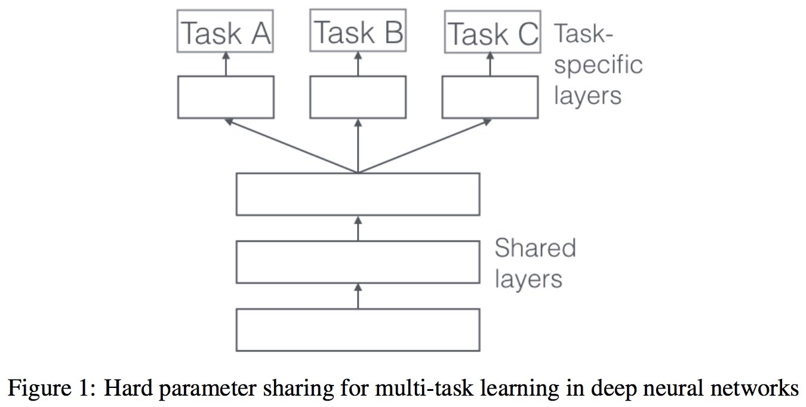
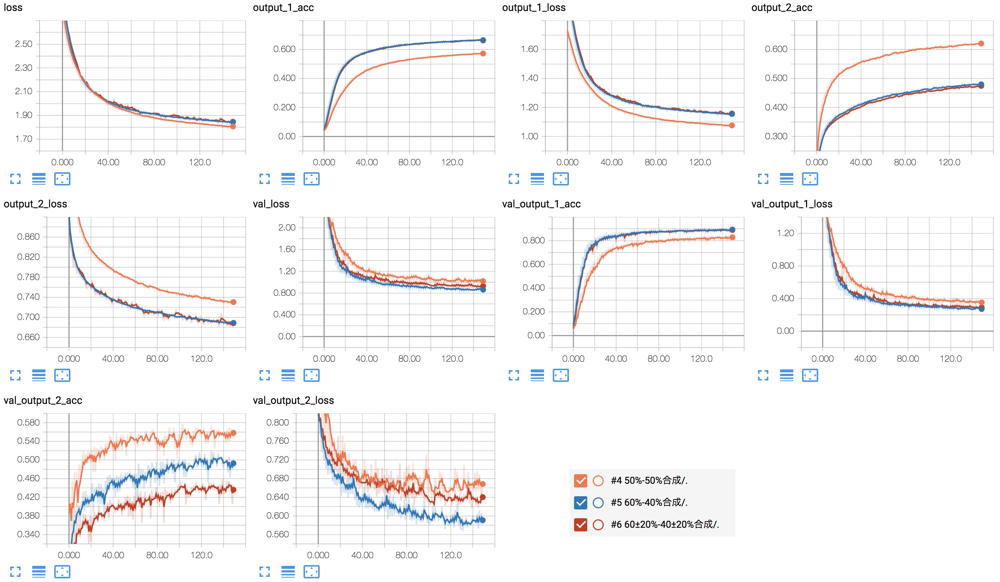
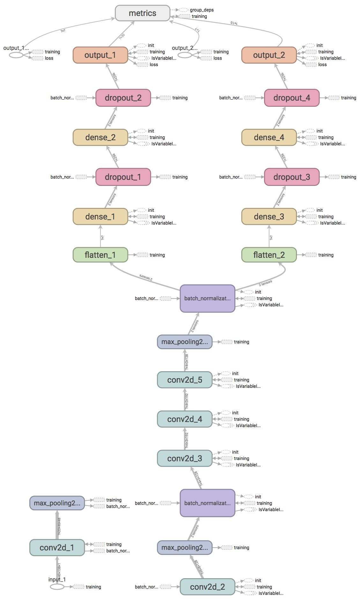

# Deep neural network for multi sound classification task

このリポジトリは、ディープニューラルネットワークを用いた音声分類のマルチタスク学習を行ったものです。

※「DL4US」の最終課題の題材として作成されました。

- - -

## ディープニューラルネットワークを用いた音声分類のマルチタスク学習

Alexa/Google Home/LINE Waveなどの音声アシスタントにより、家庭内に設置される機器での音声認識は既に普及期に入った。
これらのようにインターネット接続があれば、Google/Amazon/Microsoftが提供する機械学習サービスで質の良い音声認識が利用できる。
逆にインターネット接続がない場合や、対話のきっかけになるウェイクワードの認識は、機器側だけで音声認識を行う必要がある。

このような実際の機器に機械学習を搭載する場合、様々な環境で使われるため十分に学習が汎化している事が重要である。
しかし特に音声認識では十分大量にデータを得ることが難しいと言われており[3]、正則化などの手法を十分に活用したい。

また、機器で音を使って何かを認識する場合、声そのものの意味の他に、話者の特定や、発生の有無などその他のタスクも並行したい側面があり、マルチタスクを行わせたいニーズが潜在的にある。このマルチタスクを同時に学習させるマルチタスク学習は、汎化にも効果的である[2]。

そこで複数タスクと正則化、この２つの目的を果たすシステム構築手法の検討を、最終課題としてレポートする。

## 1. 課題設定

### 1.1 データセットとタスク設定

タスクとそのためのデータセットは下記のとおりに設定した。音声の認識をメインタスクとして、その背景シーンの認識をサブタスクとして想定した。

#### 1.1.1 メインタスク: Speech Commands Dataset の音声認識 (略称 scd)

一般に公開されているGoogleの[Speech Commands Dataset](https://research.googleblog.com/2017/08/launching-speech-commands-dataset.html)を使い、キーワードの音声認識をメインタスクとする。

- Link: https://research.googleblog.com/2017/08/launching-speech-commands-dataset.html
- ラベル数: 30
- 音声の長さ: 1秒
- このタスクのみCNN学習後の認識精度: 約94%

#### 1.1.2 サブタスク: Urban Sound 8k Dataset のシーン認識 (略称 usd)

一般に公開されている[Urban Sound 8k Dataset](https://serv.cusp.nyu.edu/projects/urbansounddataset/urbansound8k.html)を使い、シーンの認識をサブタスクとする。

- Link: https://serv.cusp.nyu.edu/projects/urbansounddataset/urbansound8k.html
- ラベル数: 10
- 音声の長さ: 最長4秒
- このタスクのみCNN学習後の認識精度: 約71%

### 1.2 音声データフォーマット

声の認識をメインタスクとしているため、これに合わせた音声データの前処理を行う。
メルスペクトログラムのパラメーターは、音声認識で一般的に使われているものとした。

- 周波数: 16kHz
- 音声の長さ: 1秒 (長い場合、ランダムに1秒切り出し)
- データ形式: メルスペクトログラム (n_mels=40, hop_length=10ms, n_fft=25ms, fmin=20Hz, fmax=4kHz)

### 1.3 ベース学習モデル

ベースとなる学習モデルは、ARMによるキーワード認識論文[1]が最新手法をカバーしており、CNNを利用しても精度はそれほど劣らないことから、AlexNet[9]をベースとしたCNNを利用する。前もってメインタスクのみをこのモデルで学習させたところ、検証セットで94%の認識率であり表現力は十分であると仮定する。

### 1.4 Requirements

- Python 3.x
- Tensorflow >= 1.5
- Keras
- Numpy
- Librosa

## 2. マルチタスク学習システム

マルチタスク学習には、Hard parameter sharing、Soft parameter sharingがある[2]。今回のシステムは、機器への組み込みを想定してHard parameter sharingを行い、畳み込み層を共通として、最終的に分類を行うFC層のみをタスク別に分ける。


<div style="text-align: center;">
[2]より引用、今回のシステムではタスクA, Bのみ。
</div>

モデルには、一つの音声データが入力され、この音声について各タスクの認識を行い出力する。

### 2.1 データセットの合成

それぞれのタスクの音声は、一つに合成してモデルに入力する。

この音声データ合成は、メルスペクトログラムデータの重み付き加算合成とした。波形レベルでの合成との差分、実際のシーンの中で発話されたときの純粋データとの差分が考えられるが、これらについては後の検討とする。

２つのタスクの音声データ長がそれぞれ異なる。そのためメインタスクの音声長1秒に合わせ、サブタスクの音声はこの長さでランダムに切り出すこととした。常にランダムに切り出すため、後の評価では正答率が取得ごとに変動するが、概ね値は変わらず、サブタスクであることから許容した。

ラベルについては、タスク別に取り扱うため特に合成の必要はないが、学習に与える損失関数の計算で合成の重み付けを反映する必要があるため、One Hotラベルにタスクごとの重みをかけた(Kerasでのcompile()のloss_weightsを使わない実現)。

([実施中に直面した問題と回避](#bad_loss_wo_task_weight)での試行錯誤の結果)

### 2.2 合成比率とその確率的変動

データセットの合成比率を変えることで学習結果に対する性能がタスクごとに異なった。

また合成比率を確率的に変化させることも行い、片方のデータセットに偏らない学習が進むことを期待し、結果を評価した。

## 3. 深層学習システム設計上の工夫

実行時のデータ前処理・マルチタスク学習のための合成処理は、将来的なタスク構成の変更やシステム自体の拡張に備え、クラス化して汎用的に使える設計とした。

また、利用したフレームワークKerasに合わせて、[`ImageDataGenerator`](https://keras.io/ja/preprocessing/image/)や[`model.fit_generator()`](https://keras.io/ja/models/model/)を前提とした設計とした。

学習以前にデータの分割(`*_split_dataset`ノートブック)、オーディオ処理を主とした事前の前処理(`*_preprocessing`ノートブック)を行うことで、その後の深層学習の試行錯誤に集中できる環境を作った。処理されたデータは全てnumpyデータとして保存することで取り扱いを容易にした。

### 3.1 データセットを取り扱うクラス

`SingleDataset`クラスでそれぞれのタスクのデータセットを取り扱う。オーディオ前処理された音声データやラベルを読み込み、全体での正規化しておく。その後学習セットについては`ImageDataGenerator`、後述の`mixup`や`Cutout`/`Random Erasing`を利用した画像処理的データ拡張を施して後段にデータを与える。検証セットは`ImageDataGenerator`を使い、学習セットと同じ正規化のみを施す。

`MultiDataset`クラスはそれぞれの`SingleDataset`のデータを入力として、適応的にデータを合成する。それぞれのデータセットに含まれるデータ数が異なるため、データ数が大きい方に合わせてバッチを整えたり(`autofill_batch`)、合成に乱数要素をもたせられるようにしたり(`_mixer`での`mix_randomness`の取り扱い)している。

データの生成は、`SingleDataset`のgeneratorで生成したデータをwrapする形で`MultiDataset`のgeneratorで改めて合成し、`model.fit_generator()`に与えている。

### 3.2 個別のデータセットに対する性能評価

このシステムではメインタスクに対してサブタスクのようなシーンの環境騒音を想定したものといえる。
静かな部屋での音声認識の性能や、逆に音声はないものの環境音からのシーン認識の性能を個別に評価したい。

そのため、`MultiDataset`クラスに`evaluate_by_datasets`メソッドを用意して、

```python
multi.evaluate_by_datasets(model)
```

このように実行することで、

```
Evaluating scd_dataset
6798/6798 [==============================] - 10s 1ms/step
 = 0.9018829067372757
Evaluating usd_dataset
990/990 [==============================] - 1s 1ms/step
 = 0.593939393939394
Accuracy with scd_dataset = 0.901883
Accuracy with usd_dataset = 0.593939
```

このように結果をタスク別で得られるようにした。

### 3.3 十分な可視化による確認

マルチタスクを取り扱うため、データの種類や処理過程の煩雑さが増し、間違いが起こりやすくなった。
前処理、データ拡張、合成の結果が正しいことを逐一確認する必要があり、可視化は重要な開発要件となった。

- `plot_dataset`関数や`audio_preprocessing.show_melspectrogram`を作成し、データセット内外の音声データを可視化。
- データの分割時(`*_split_dataset`ノートブック)、クラスごとのデータの偏り、ラベルの一覧、学習/検証/テスト各セットの分布を可視化し、データセットレベルでの間違いを防止。
- データセットについては、Leakageがないか更に念のため可視化して確認した(`*_split_dataset`ノートブック)。

### 3.4 データ拡張手法の利用

- ２つのデータをミックスする手法mixup[5]を使い、クラス間のデータをミックスすることで汎化性能強化を図った。
- 同様にCutout[6]またはRandom Erasing[7]を使い、データをランダムに切り取ることで汎化性能強化を図った。
- `ImageDataGenerator`では時間方向のシフト、左右反転を利用した。

### 3.5 最適化アルゴリズムと学習率

学習率にはCyclic Learning Rate[8]による周期的変化を利用することで、最適化の効率化を図った。このレポートでは、この学習率変化の過程で見つかる最良の正答率を示したモデルを、モデルの結果として採用した。

最適化アルゴリズムには、Adamを利用した。

### 3.6 Fine Tuning

一旦学習させたモデルを、各タスク側のFC層重みだけを学習し、それ以外の重みをFreezeすることでFine Tuneした。
メインタスクだけに影響するFC層、次にサプタスクだけに対してFine Tuneすることで各タスクの性能向上を両立させることが期待できる。

## 4. 学習実施と評価の概要

このレポートで試行した内容は、全て下記の概要の通りJupyter Notebookにまとめた。

### 4.1 データセットごとの事前準備と評価

下記のように各々のデータセットに対して事前の確認を行い、それぞれ単純な分類問題として妥当な結果を出せることを確認した。

#### Speech Commands Dataset

- speechcmd1_split_dataset データ分割と内容・Leakageなきことの確認。
- speechcmd2_preprocessing オーディオ前処理とnumpyデータ化。
- speechcmd3_model1 このデータセットだけでの学習と評価セットでの正答率確認。

#### Urban Sound Dataset

- urban_sound1_split_dataset データ分割と内容・Leakageなきことの確認。
- urban_sound2_preprocessing オーディオ前処理とnumpyデータ化。
- urban_sound3_model1 このデータセットだけでの学習と評価セットでの正答率確認。

### 4.2 マルチタスク学習の実施と評価

#### No.1-3 マルチタスク学習システム事前評価

下記のようにシステムの実装と動作確認を行った(合成クラスの実装とテストで2日程度要した)。

- mixed_model1 & 2 欠番、学習モデルのデバッグを実施、概ね動いている様子までを確認。
- mixed_model3 scd only learning マルチタスク学習モデルをscd=100%、usd=0%で学習させ動作確認。

#### No.4 合成比率50%:50%での学習と評価

- mixed_model4 50%50% により学習させて評価。

#### No.5 合成比率60%:40%での学習と評価

- mixed_model5 60%40% により、音声認識に比重をおいて学習、評価。

#### No.6 合成比率60±20%:40±20%での学習と評価

- mixed_model6 60%40%+-20% により、更に確率的に比率を20%変動させて学習、評価。

#### No.7 Freeze & Fine Tune(No.4 ベース)後の評価

- mixed_model7 4_50%50% to fine tune によりFine Tuneを行った後に評価。

#### No.8 Freeze & Fine Tune(No.5 ベース)後の評価

- mixed_model8 5_60%40% to fine tune によりFine Tuneを行った後に評価。

#### No.9 Freeze & Fine Tune(No.6 ベース)後の評価

- mixed_model9 6_60%40%+-20 to fine tune によりFine Tuneを行った後に評価。

## 5. 結果と考察

### 5.1 正答率の比較

epochは150回固定、それぞれの正答率は以下のようになった。「scdのみ」列と「usdのみ」列はデータをそれぞれその評価セットを与えた個別の結果。「ミックスscd」列と「ミックスusd」列は、それぞれの比率で混合した評価セットを与えたときの結果。

| No. | 学習バリエーション | scdのみ | usdのみ | ミックスscd | ミックスusd |
|:---:|:---------------:|--------|---------|-----------|------------|
| - | scdのみ学習した結果(ベースライン) | 0.944 | N/A | 0.864* | N/A |
| - | usdのみ学習した結果(ベースライン) | N/A   | 0.710 | N/A | N/A |
| 4 | 合成比率50%:50%固定 | 0.902 | 0.594 | 0.828 | 0.563 |
| 5 | 合成比率60%:40%固定 | 0.929 | 0.545 | 0.902 | 0.513 |
| 6 | 合成比率60±20%:40±20% | 0.934 | 0.530 | 0.898 | 0.489 |
| 7 | No.4 Fine Tune後 | 0.905 | 0.592 | 0.822 | 0.517 |
| 8 | No.5 Fine Tune後 | 0.932 | 0.591 | 0.896 | 0.482 |
| 9 | No.6 Fine Tune後 | 0.935 | 0.543 | 0.897 | 0.462 |
<div style="text-align: center;">
* scdのみ学習した通常の分類モデルに、合成比率60%:40%でscdとusdをミックスした検証セットを与えた結果。
</div>

総じて合成比率に結果が左右されている。またミックスの結果は、一方のデータセットが他方に対してノイズとなった状態で実環境に近く、個別の結果に比べて性能が劣る結果となっている。

1. ベースラインとマルチタスク学習を個々のタスクのみで比較すると、性能向上を期待したものの逆に到達していない。特にサブタスクは顕著で、逆に性能が著しく落ちている。メインタスクはそれ自体ベースラインにやや劣る結果となった。しかしミックスした実環境に近い評価セット「ミックスscd」列を比較すると、scdのみの学習では8%性能が悪化するのに対して、例えばNo.5では2.7%の性能悪化となり、5%近くロバスト性能改善していることが分かる。
2. 合成比率をメインタスク側に偏らせることで、メインタスクの汎化性能を上げることに貢献するようだ。No.4に対してNo.5または6のミックスscdの結果に着目すると、約7%の音声認識性能改善となっており大きい。これは雑音環境下での音声認識がロバストになっていることを表している。逆にシーン認識の性能は5%落ちており、トレード・オフの関係にありそうだ。
3. Fine Tune前後の結果を見てみると、タスク別の結果を見る限り、特にusdのみの結果で数%改善している。しかし一見タスクに特化され良くなったように見えるが、逆にミックス環境下で性能が悪化していることに注目したい。例えばNo.5(Fine Tune前)とNo.8(Fine Tune後)それぞれミックスの結果では、scdは約1%、usdは約3%劣っている。つまりこれは、汎化性能の悪化を招いているとも言える。特にサブタスクusdにおいて、Fine TuneしたNo.7-9では、単一タスクに対してミックス時に8〜11%性能が悪化しており、これはNo.4-6の結果の3-5%の性能悪化に比べて問題が大きい。Fine Tuneするとシンプルな評価セットの結果では一見良くなるが、実環境で逆に性能が悪くなる。

今回のシステム構成は、「メインタスクのロバスト性を上げるためのマルチタスク学習」として、メインタスクのネットワーク重み計算の手法として意味があると言えそうだ。逆に両タスク共に性能の向上が必要な場合、更なる検討が必要だ。

#### 5.1.1 (レポート提出後) scdの純粋なデータ拡張としてシングルタスクモデルを学習した場合

今回の結果はscdを分類するモデルのデータ拡張としての意味合いとなった。そこで、シンプルなシングルタスクのモデルにscdとusdをミックスしたデータを与え、純粋なデータ拡張として学習させた場合どうなるかを検証した。

| No. | 学習バリエーション | scdのみ | usdのみ | ミックスscd | ミックスusd |
|:---:|:---------------:|--------|---------|-----------|------------|
| X | scdモデルに6:4 mixを与えたとき | 0.937 | N/A | 0.906 | N/A |

- scdの分類を行うAlexNetベースのモデル。
- 学習データには、scdに対して、背景ノイズとしてusdを6:4でミックス。

結果として、このように単純にデータ拡張した方が、マルチタスクの場合より性能良く学習させることができた。

### 5.2 学習曲線の比較

それぞれの学習曲線は以下のようになった。


<div style="text-align: center;">
学習曲線
</div>

今回epochを固定して比較したが、この時点で性能が出ていないものも学習を続けることで改善が予想される。

合成比率を確率的に変動するNo.6が顕著で、サブタスクが十分に学習できていないと思われる。確率的に合成比率を変える場合、長い学習時間が必要になるのではないだろうか。

## 6. まとめ

マルチタスク学習による音声データの認識タスクを設定し、ディープニューラルネットワークの学習と評価を行った。

正答率の結果を比較したとおり、個々のタスクの明らかな性能向上は今回得られなかったものの、メインタスクをロバストにできることが示せた。データセットには、実環境でとり得るあらゆるノイズを使うことが、ロバスト性の確保に重要であることが改めて示されたものだと思われる。

今回はマルチタスク学習でシステム構築したが、その際は合成比率と学習epochの調整がポイントになると思われる。
また、あらゆるノイズのデータさえあれば、メインタスクにデータ拡張を施すことでシンプルにシステムの構築を進めても同様の効果が期待できると思われる。このことも改めて確認できた。

マルチタスク学習において、Fine Tuningとして最後に個別のタスクに最適化させることは、雑音環境下のロバスト性に対して悪化の傾向が見られるため、行うべきではないことが確認できた。
特に実際の製品に応用する時、クリーン環境に比べ実環境の雑音下での性能劣化のトラブルとなり得ることが示された。

またこのようにデータセットにノイズを加えて評価をすることは、機械学習を外注する際の受け入れ評価についても示唆的だと思われる。

### 謝辞

DL4USを運営された皆様に感謝いたします。深層学習について多くの事柄をカバーしていただき、知識と実習による経験を深めることができました。

ありがとうございました。


## 7. 実施中に直面した問題と回避

#### マルチタスクの性能評価の難しさ

今回のタスクはそれぞれ同時に発生しうるが、それぞれだけを利用するケースも考えられる。
そのため評価をどうするべきか、個別の評価&同時生起時の評価どちらも行う結論に至るまでに時間を要した。

また、個別の評価をKerasに合わせて設計することを試みたため難航した。
結果としてKerasの設計を回避する形で評価関数を実装することになり、特定のプラットフォームに依存しない設計の切り分けはノウハウとのバランスが必要だった。

試行錯誤の過程で、学習セットは問題ないものの評価セットでval_loss/val_accが正しく計算できないことがあった。
この場合、ベースラインとの比較や、学習の進捗を確認することができず、開発を進められないことをよく理解できた。

<a name="bad_loss_wo_task_weight"></a>
#### 一見実行できるが精度が向上していかないケース

例えば次のような手順で実施すると問題が発生した。このような問題では、試行自体に何かミスがあるようにみえるため、問題の切り分けに時間を要した。

1. ある一つのノートブックで学習をスタートさせる。
2. 次のノートブックでデータの読み込みやモデルのcompileまでを実施して準備する。
3. 一つ目のノートブックが実行終了したあと、次のノートブックの学習を開始する。一見開始できるが、精度が向上せず内部の計算に何か問題が起こっている。

問題のある学習は一旦停止し、Restartすることで解決した。

※ データの送受信や保存を自由に行うため、iLectを使わず、一般的なNvidia製GPU(GTX1070)を搭載したUbuntu環境を利用した。
環境依存の問題とも考えられる。


## 8. 参考文献

- [1] Hello Edge: Keyword Spotting on Microcontrollers, Feb 2018.
- [2] Sebastian Ruder, An Overview of Multi-Task Learning in Deep Neural Networks, 2017.
- [3] medium.com, Adam Geitgey, Machine Learning is Fun Part 6: How to do Speech Recognition with Deep Learning.
- [4] St_Hakky’s blog, kerasでmultiple (複数の) 入力 / 出力 / 損失関数を扱う時のTipsをまとめる.
- [5] Hongyi Zhang, Moustapha Cisse, Yann N. Dauphin, David Lopez-Paz, "mixup: Beyond Empirical Risk Minimization," in arXiv:1710.09412, 2017 [cs.LG]
- [6] T. DeVries and G. W. Taylor, "Improved Regularization of Convolutional Neural Networks with Cutout," in arXiv:1708.04552, 2017.
- [7] Z. Zhong, L. Zheng, G. Kang, S. Li, and Y. Yang, "Random Erasing Data Augmentation," in arXiv:1708.04896, 2017.
- [8] Leslie Smith, Cyclical Learning Rates for Training Neural Networks, arXiv:1506.01186v4.
- [9] Alex Krizhevsky, Ilya Sutskever, and Geoffrey E. Hinton. ImageNet Classification with Deep Con- volutional Neural Networks. In NIPS, 2012.

## A. Annex

### A1. ネットワーク構造

AlexNet[9]をベースに、メルスペクトログラムの時系列データ(40x138)に合わせ入力に近い層を調整、FC層をタスクごとに分岐した。


<div style="text-align: center;">
ネットワーク構造図: メインタスクは出力1(output_1)、サブタスクは出力2(output_2)
</div>

